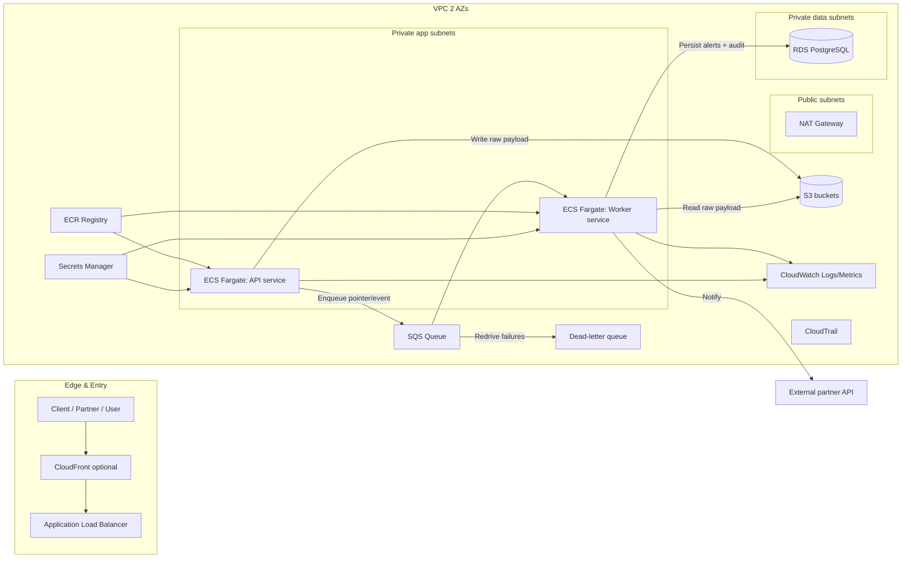
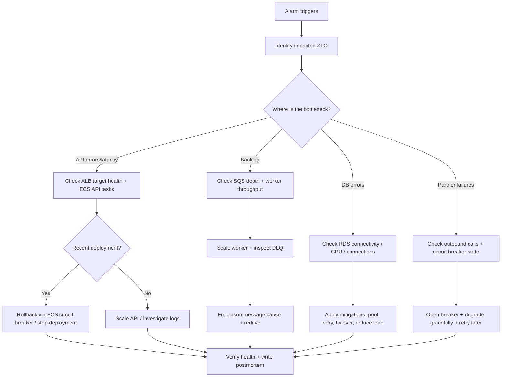

# Production-Grade Secure Cloud Platform Blueprint (PGSCP)

> Source: detailed follow-up blueprint. This is the authoritative technical design for PGSCP. Executable plan lives in [../plan.md](../plan.md).

## Executive summary

This blueprint is designed to be interview-ready for a Cloud Engineer role focused on **AWS ownership, security posture, CI/CD discipline, observability, reliability, and cost control**. The project ("PGSCP") is intentionally shaped around a real operational pattern: **real-time event ingestion → asynchronous processing → alerting → secure partner integration**. It forces demonstration of the exact fundamentals the job description emphasizes: least-privilege IAM, reproducible Infrastructure as Code, safe deployment/rollback strategies, actionable monitoring with low-noise alerts, incident response/postmortems, and thoughtful cost tradeoffs (especially around NAT and logging).

The system is scoped to be buildable in **6 weeks at 5–20 hours/week** with progressive deliverables and clear checkpoints.

### Key default recommendations

- Use **ECS Fargate** (simpler ownership story than EKS unless the company clearly runs Kubernetes).
- Use **SQS + DLQ** for asynchronous work (avoid Kafka/MSK unless you truly need replayable multi-consumer streams).
- Use **Terraform modules + remote state on S3 with locking** and strict secrets handling (never hardcode secrets in config/state).
- Use **CloudWatch Logs/Metrics + CloudTrail** as the "default auditability backbone"; optionally add OpenTelemetry traces to X-Ray or ADOT.
- Treat "ISO 27001 direction" as **evidence and control mapping**: change tracking, access control, logging/monitoring, vulnerability management, incident response discipline.

### Assumptions

- One AWS account for the project (optional upgrade: multi-account later).
- One region, two Availability Zones.
- Public traffic is HTTPS-only and hits an ALB (optionally fronted by CloudFront).
- RDS is PostgreSQL, encrypted at rest, not publicly accessible.
- Partner integration is over HTTPS to an external endpoint you control (mock server), with retries + idempotency + circuit breaker patterns.

## Architecture and data flows

### End-to-end architecture diagram



### Core AWS behaviors this relies on

- ALB routes HTTP/HTTPS to ECS services and uses target group health checks to ensure only healthy tasks receive traffic.
- Private subnets can access the internet *outbound* via NAT without receiving unsolicited inbound traffic.
- CloudFront can use ALB as an origin and can be configured to restrict direct access via custom headers/prefix lists.
- SQS standard queues provide **at-least-once delivery**, so consumers must be idempotent.
- DLQ patterns are first-class in SQS with redrive policies.

## Responsibilities and boundaries by component

- **API service**: minimal, fast, stateless ingest; validate schema; persist raw event to S3; enqueue work to SQS; return 202 quickly; emit structured logs/metrics.
- **Worker service**: polls SQS with long polling; loads raw event; runs rule engine; writes an immutable audit record + current alert status to Postgres; calls partner API with secure patterns; handles retries; routes poison messages to DLQ.
- **SQS + DLQ**: buffering, failure isolation, async scalability; DLQ is your "quarantine" and enables triage/redrive.
- **ECS Fargate**: container runtime with clean IAM boundaries (task role vs task execution role).
- **VPC**: prevent lateral movement; enforce least privilege at the network layer (only ALB public). Route tables define traffic paths; NAT provides controlled egress.
- **Secrets Manager + IAM**: no secret sprawl; rotation-ready; least privilege is enforced and auditable.
- **CloudWatch + CloudTrail**: operational plus compliance-grade auditability. CloudTrail records actions by users/roles/services; CloudWatch provides logs, dashboards, alarms.
- **Terraform + CI/CD**: everything is reproducible; changes are reviewed; deployments are safe; rollbacks are fast. Terraform state is protected and not used as a secret store.

## Component deep-dive

### API service

**API contract** — minimal endpoints:
- `POST /events` → accepts JSON event, returns 202 Accepted with `event_id` and `trace_id`
- `GET /alerts` → query alerts by device_id/time/status
- `GET /health` → basic liveness (process up)
- `GET /ready` → readiness (can reach required dependencies like SQS endpoint and Secrets Manager access; optionally DB)
- `GET /metrics` → Prometheus-format metrics *or* emit CloudWatch metrics via EMF logs

**Data flow for `POST /events`**:
1. Validate payload.
2. Construct `event_id` (UUID) and `idempotency_key` (preferably from client header like `Idempotency-Key`; otherwise derive from stable fields).
3. Write raw payload to S3 (partitioned key like `raw/device_id=.../dt=.../event_id.json`).
4. Send message to SQS containing: `event_id`, S3 bucket/key, `device_id`, timestamp, `schema_version`, `idempotency_key`.
5. Return 202 quickly.

CloudFront (optional) can sit in front of ALB for caching/static distribution; if used, restrict direct ALB access via a CloudFront-added secret header or CloudFront IP prefix list.

### Worker service

**Polling model** — Use SQS long polling (`WaitTimeSeconds > 0`, max 20 seconds) to reduce empty receives and cost. Set visibility timeout > maximum expected processing time; use DLQ for repeated failures. Because SQS standard queues are at-least-once, handle duplicates in the worker via idempotency.

**Rule engine sketch** — Implement "anomaly" as operational alert rules (good for this Cloud role and avoids ML rabbit holes):
- hard threshold (temp > X)
- rate-of-change (|Δ| > X)
- stuck sensor (no change for N minutes)
- missing heartbeat (no event for N minutes)
- out-of-range for a mode (mode-dependent thresholds)

**Persist**:
- `events_ingested` (optional)
- `alerts` table (current state)
- `alert_events` table (immutable transitions: created, escalated, resolved)
- `partner_delivery_attempts` table (audit)

RDS storage is encrypted using AWS KMS; choose Multi-AZ for production-like resilience.

### SQS + DLQ

- One main queue `events-queue`
- One DLQ `events-dlq`
- Redrive policy (e.g., `maxReceiveCount = 5`)

SQS DLQs are a standard mechanism to isolate poison messages and reduce repeated failure loops.

### ECS Fargate, ALB, and deployments

**ECS IAM model**:
- **Task execution role**: used by ECS/Fargate agent to pull images from ECR and send logs (awslogs).
- **Task role**: used by your application code to call AWS APIs (S3, SQS, Secrets Manager).

For Fargate, configure task definition `logConfiguration` with the `awslogs` driver to route stdout/stderr to CloudWatch Logs.

**Rollback behavior** — Enable ECS **deployment circuit breaker with rollback**, so failed deployments revert to last known good state. ECS also has stop-deployment rollback tooling ("1-click rollbacks") via API/console — a strong interview add-on.

### VPC, subnets, routes, NAT, and cost

**Network story**:
- Public subnets: ALB + NAT gateway
- Private app subnets: ECS tasks
- Private data subnets: RDS

NAT gateways have both hourly charges *and* data processing charges; they frequently become a surprise cost center for container workloads that pull images and call AWS APIs.

**Cost/security improvement: add VPC endpoints so private tasks access AWS services without NAT**:
- S3 **gateway endpoint** (no additional cost; keeps S3 traffic on AWS network)
- ECR interface endpoints to pull images privately
- Secrets Manager interface endpoint to retrieve secrets without NAT/IGW
- CloudWatch Logs interface endpoint if you want logging without NAT

This is a high-signal "infra ownership" talking point because it mixes security, reliability, and cost control.

### RDS PostgreSQL

**Minimum for interview**:
- Not publicly accessible
- Encrypted at rest via KMS
- Backups enabled
- Multi-AZ for prod (optional in dev)
- Security group only allows from API/worker SG

RDS encryption uses AWS KMS keys (AWS-managed or customer-managed). Multi-AZ deployments provide standby instances for failover.

Optional: RDS Proxy for connection pooling/resilience patterns for spiky workloads.

### S3 buckets

At least two buckets:
- `pgscp-raw-events` (raw ingestion archive)
- `pgscp-logs` (ALB access logs, CloudTrail logs destination if you choose)
- optional `pgscp-tfstate` (Terraform remote state bucket)

S3 applies base-level server-side encryption by default (SSE-S3). For tighter control/audit, use SSE-KMS.

### Secrets Manager and secret rotation

Secrets Manager supports storing and rotating credentials; rotation updates both the secret and the target service credentials.

**Critical interview point**: Terraform state can store sensitive data in plain text if secrets are placed directly into configuration; AWS Prescriptive Guidance explicitly calls this out and recommends using Secrets Manager plus strict state access control.

### CloudWatch, CloudTrail, and auditability

CloudTrail records actions by users/roles/services as events and supports operational/risk auditing, governance, and compliance. It has management events (logged by default) and data events (not logged by default; can incur additional charges).

CloudWatch Logs Insights enables interactive querying of log groups during incident response and verification of fixes.

### External partner integration pattern

Recommended baseline pattern:
- Outbound HTTPS call from worker to partner endpoint
- API key stored in Secrets Manager
- **Request signing** (HMAC over body + timestamp) to detect tampering/replay (even if API key leaks)
- **Strict timeouts** (e.g., connect 1s, total 3–5s)
- **Retries with exponential backoff + jitter** for transient failures
- **Circuit breaker** to prevent thundering herd when partner is down
- **Idempotency key** (`partner_request_id`) so retry does not create duplicates

Idempotency is required because SQS standard queues can deliver duplicates; if you need broker-level deduplication, evaluate SQS FIFO with deduplication IDs.

### CI/CD with GitHub Actions and OIDC

Avoid static AWS credentials in GitHub. Use **OIDC to assume an IAM role** scoped to repo/branch. Use GitHub Environments to enforce production deployment approvals and protection rules.

### Terraform module strategy

Use HashiCorp's standard module structure so the repo is readable and reusable. Use **S3 backend with encryption (KMS) and locking** (S3 native lock is recommended; older DynamoDB lock is legacy).

## Security and ISO-27001-aligned control mapping

This section is not about claiming certification — it's about showing **audit-ready engineering signals**.

### Control themes to demonstrate

- **Access control & least privilege** — IAM roles per workload; no shared roles across services; narrow Resource ARNs; prefer condition keys. Use IAM Access Analyzer to refine policies toward least privilege.
- **Audit logging & traceability** — CloudTrail enabled; log retention; alert on unusual role assumptions. Application logs include correlation IDs and partner request IDs.
- **Configuration management / change tracking** — Infrastructure via Terraform; PR-reviewed; plans captured; apply gated for production. Optionally enable AWS Config.
- **Secrets handling and rotation** — Secrets Manager used; rotate DB creds or at least demonstrate how rotation would be enabled.
- **Vulnerability management** — Dependency scanning in CI + container image scanning. Optional: Inspector/GuardDuty/Security Hub mapping.

### Least-privilege IAM examples

**ECS task role for API service**:

```json
{
  "Version": "2012-10-17",
  "Statement": [
    {
      "Sid": "S3WriteRawEvents",
      "Effect": "Allow",
      "Action": ["s3:PutObject"],
      "Resource": "arn:aws:s3:::pgscp-raw-events/raw/*"
    },
    {
      "Sid": "SQSSend",
      "Effect": "Allow",
      "Action": ["sqs:SendMessage"],
      "Resource": "arn:aws:sqs:REGION:ACCOUNT_ID:pgscp-events"
    },
    {
      "Sid": "ReadSecrets",
      "Effect": "Allow",
      "Action": ["secretsmanager:GetSecretValue"],
      "Resource": "arn:aws:secretsmanager:REGION:ACCOUNT_ID:secret:pgscp/*"
    }
  ]
}
```

**ECS task role for worker service**:

```json
{
  "Version": "2012-10-17",
  "Statement": [
    {
      "Sid": "SQSConsume",
      "Effect": "Allow",
      "Action": [
        "sqs:ReceiveMessage",
        "sqs:DeleteMessage",
        "sqs:ChangeMessageVisibility",
        "sqs:GetQueueAttributes"
      ],
      "Resource": "arn:aws:sqs:REGION:ACCOUNT_ID:pgscp-events"
    },
    {
      "Sid": "S3ReadRawEvents",
      "Effect": "Allow",
      "Action": ["s3:GetObject"],
      "Resource": "arn:aws:s3:::pgscp-raw-events/raw/*"
    },
    {
      "Sid": "ReadSecrets",
      "Effect": "Allow",
      "Action": ["secretsmanager:GetSecretValue"],
      "Resource": "arn:aws:secretsmanager:REGION:ACCOUNT_ID:secret:pgscp/*"
    }
  ]
}
```

## Observability, SLOs, and operational discipline

### What to measure (SLOs)

- **Ingestion availability**: % of successful `POST /events` (2xx) over time
- **Ingestion latency**: p95 and p99 for `POST /events`
- **Processing freshness**: time from event ingest to alert persisted
- **Backlog health**: SQS `ApproximateNumberOfMessagesVisible` and DLQ depth
- **Partner delivery**: success rate, p95 latency, error codes
- **Reliability signals**: ECS task restarts, CPU/memory saturation, ALB unhealthy host count

### Logs: structured with correlation IDs

Minimum logging fields: `timestamp`, `service` (api/worker), `env`, `level`, `trace_id`, `request_id`, `event_id`, `device_id`, `idempotency_key`, `partner_request_id`, `error_type` (timeouts, validation, downstream).

Route container logs to CloudWatch Logs via the `awslogs` driver. Use CloudWatch Logs Insights to query during incidents and validate fixes.

### Tracing with OpenTelemetry

For an interview "wow factor," add OpenTelemetry instrumentation to FastAPI:
- auto-instrument FastAPI
- propagate trace context through messages (store `traceparent` in SQS message attributes)

If you want the most AWS-native story, use **AWS Distro for OpenTelemetry (ADOT)** to send traces to X-Ray and/or CloudWatch/Managed Prometheus.

### Alert rules (high-signal, low-noise)

- API 5xx rate > 1% for 5 minutes
- API p95 latency > 500ms for 10 minutes
- SQS backlog > threshold for 10 minutes (processing is falling behind)
- DLQ has any messages (immediate triage)
- Partner delivery failure rate > threshold
- ECS service running task count < desired (degraded)

### Incident runbook template

- **Trigger**: which alarm fired; severity level
- **Impact**: affected endpoints/customers; data loss risk?
- **First checks**: ALB target health; ECS desired vs running; recent deploy events; SQS queue depth; DLQ depth
- **Triage**: API vs worker vs partner vs database
- **Mitigation**: scale out worker; disable partner calls; rollback last deploy; increase visibility timeout temporarily; pause ingestion if needed
- **Recovery**: redrive DLQ; replay messages; verify SLOs back to normal
- **Follow-up**: create corrective actions and add regression tests

## Failure modes, troubleshooting playbook, and postmortems

### Failure/recovery flow



### Common incidents

**ALB health checks failing**
- Detection: ALB target group unhealthy hosts, spikes in 5xx
- Checks: target group health status; confirm health check path/port
- Likely causes: wrong port mapping, readiness not passing, app startup time too slow, security group rules
- Mitigation: adjust health check path; improve `/health` behavior; ensure ECS container port matches target group

**Worker falling behind**
- Detection: SQS backlog rises; processing latency increases
- Checks: worker task count, CPU, memory; message processing time; visibility timeout
- Mitigation: scale worker via ECS autoscaling; optimize hot path; increase visibility timeout if necessary

**Poison messages accumulating**
- Detection: DLQ depth > 0
- Checks: sample message; identify schema/validation edge; isolate offending device_id
- Mitigation: patch parser; deploy fix; redrive DLQ back to source queue

**Partner API outage or instability**
- Detection: partner error rate alert; retries exploding
- Checks: circuit breaker state; outbound NAT connectivity; partner status
- Mitigation: open breaker; degrade partner notifications (store for later); implement backoff and idempotency

### Postmortem template

- Summary (what happened, when)
- Customer impact (who/what, duration)
- Detection (which signals/alerts)
- Root cause (technical + contributing factors)
- Timeline (key events)
- Resolution
- Corrective actions
  - prevention
  - detection improvements
  - runbook updates
- Evidence (dashboards/log queries/deploy IDs)

## Six-week roadmap (adaptable to 5–20 hrs/week)

Weekly rhythm:
- **5–8 hrs/week**: 3 deliverables/week only
- **10–15 hrs/week**: all deliverables + optional stretch tasks
- **15–20 hrs/week**: add endpoints, OTel tracing, tighter policies, and chaos tests

| Week | Deliverables | Checkpoints to demo |
|---|---|---|
| A | Repo skeleton + FastAPI API + Docker builds | Local `docker compose up` runs API; `/health` and `/events` work |
| B | SQS + worker + DLQ + idempotency store | Duplicates don't create duplicate alerts; poison message goes to DLQ |
| C | Terraform network + ECS cluster + ALB + ECR | `terraform apply` deploys API behind ALB; ALB health checks pass |
| D | RDS + Secrets Manager + IAM least privilege | No secrets in repo; ECS tasks retrieve secrets at runtime; DB not public |
| E | CI/CD (plan/apply gates) + rollback | PR produces terraform plan; main deploy works; demonstrate rollback via ECS circuit breaker |
| F | Observability + runbooks + simulated incident + postmortem | Alarm firing + logs insights query + fix + postmortem document |

## Interview demos

### Demo one: Deploy + smoke test (6–8 minutes)
- Show `terraform apply` (or CI run) deploying dev environment
- Hit ALB DNS name `/health` and `/events` (202)
- Show CloudWatch logs for API receiving the event
- Show the message arriving in SQS and being processed by worker
- Show alert row in DB or `/alerts` endpoint

### Demo two: Simulate incident + debug (8–10 minutes)
- Introduce a poison message (invalid schema / causes worker exception)
- Show DLQ receives the message after maxReceiveCount
- Use CloudWatch Logs Insights query to find the exception and event_id
- Patch worker; redeploy; redrive DLQ to main queue; show successful processing
- Close with a short postmortem summary

### Demo three: Secure partner integration (6–8 minutes)
- Show outbound request with `partner_request_id` idempotency key and HMAC signature header
- Simulate partner instability (return 500/timeouts)
- Show retries + backoff; then circuit breaker opens; alerts stored for later delivery
- Show audit table of delivery attempts (for traceability)

## Design tradeoff tables

### ECS vs EKS
| Dimension | ECS (Fargate) | EKS | Recommendation |
|---|---|---|---|
| Operational overhead | Lower; AWS-native | Higher; Kubernetes platform ops | Start with ECS to emphasize ownership, security, reliability |
| Hiring signal | Strong AWS operator | Strong K8s operator | ECS is sufficient and often preferred for "infra owner" in early startups |

### RDS vs Aurora
| Dimension | RDS PostgreSQL | Aurora PostgreSQL | Recommendation |
|---|---|---|---|
| Simplicity | High | Medium | Begin with RDS |
| Scaling/read replicas | Standard patterns | Cloud-native storage/replica model | Mention Aurora as upgrade path |
| Availability | Multi-AZ patterns | Strong HA model | Use Multi-AZ in prod |

### SQS vs Kafka (MSK)
| Dimension | SQS | Kafka/MSK | Recommendation |
|---|---|---|---|
| Model | Pull-based queue; buffering and async tasks | Event streaming log, multi-consumer replay | Use SQS for async processing/alerts |
| Operational overhead | Low | Higher | SQS fits the project and interview scope better |

### Secrets Manager vs Parameter Store
| Dimension | Secrets Manager | Parameter Store | Recommendation |
|---|---|---|---|
| Rotation | Built-in | Limited | Use Secrets Manager for credentials |
| Audit posture | Strong governance | Good for config | Parameter Store for non-secret config only |

### CloudWatch vs Prometheus/Grafana
| Dimension | CloudWatch | Prometheus/Grafana | Recommendation |
|---|---|---|---|
| Setup complexity | Low, AWS-native | Higher unless managed | Default to CloudWatch |
| Interview story | Strong "AWS owner" | Strong "platform engineer" | CloudWatch-first; mention Prometheus/Grafana as maturity path |

## What to "say out loud" in interviews

- "I separated ingestion from processing using SQS so the API stays responsive under load and failures don't cascade; DLQ quarantines poison messages and supports safe redrive."
- "I used ECS task roles to prevent static credentials, and IAM policies are resource-scoped and iteratively tightened using least-privilege practices."
- "Deployments are gated, auditable, and rollback-safe via GitHub environments plus ECS deployment circuit breaker rollback."
- "I reduced NAT dependency by using VPC endpoints for S3, ECR, and Secrets Manager — this improves security and can materially reduce NAT costs."
- "Terraform state is treated as sensitive because secrets can leak into state/plan; Secrets Manager is the canonical secret store."
